## 安装 Java 语言的软件开发工具包
```
brew cask install java
```
或者在 [Oracle官网](http://www.oracle.com/technetwork/java/javase/downloads/jdk8-downloads-2133151.html) 中选择 Mac 版本 `jdk-8u111-macosx-x64.dmg` 下载并安装。

## 安装 Solr

```
brew install solr
```
当前(2016-11-10) brew 源的 Solr 版本为 6.1.0，你可以通过`brew edit solr`来修改你要安装的版本，或者通过[官方网站](http://www.apache.org/dyn/closer.lua/lucene/solr/)下载源码包来进行编译安装。

## 启动 Solr
```
solr start
```
返回以下文字提示，则表示 solr 服务器安装成功，默认监听的端口号为 8983:
```
Waiting up to 30 seconds to see Solr running on port 8983 [\]
Started Solr server on port 8983 (pid=890). Happy searching!
```

## 在浏览器中访问

Solr 提供了可视化管理界面`Solr Admin`，默认的访问URL为： [http://localhost:8983/solr/](http://localhost:8983/solr/)

## 创建一个名为 test 的 `core`
```
solr create -c test
```
返回以下信息，则表示创建成功：
```
Copying configuration to new core instance directory:
/usr/local/Cellar/solr/6.1.0/server/solr/test

Creating new core 'test' using command:
http://localhost:8983/solr/admin/cores?action=CREATE&name=test&instanceDir=test

{
  "responseHeader":{
    "status":0,
    "QTime":8845},
  "core":"test"}
```
这一命令会在`/usr/local/Cellar/solr/6.1.0/server/solr/`目录下创建一个命令`test/`的目录，`test/`目录中包含了`test core`相关的数据文件和配置文件。

在`Solr Admin`管理界面可以看到`test core`的信息：

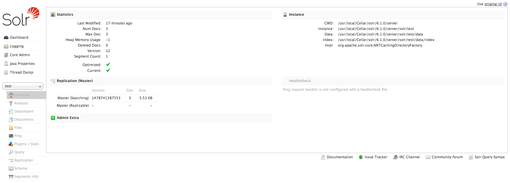

## 安装 MySQL 数据库
```
brew install mysql
```
将root的密码修改为123456。或者其他你喜欢的密码：
```
mysqladmin -u root password '123456'
```
这个 MySQL 账号会在配置 Solr 索引 MySQL 信息时使用到。

添加测试用于测试的数据：
```
create database solrdata;
use solrdata;
create table goods(id int not null auto_increment, name varchar(20) not null default '', number varchar(20) not null default '', updateTime timestamp not null default CURRENT_TIMESTAMP on update CURRENT_TIMESTAMP, primary key(id));
insert into goods(name, number)  values('鞋子', 100);
insert into goods(name, number)  values('衣服', 200);
insert into goods(name, number)  values('裤子', 300);
```

## 下载 MySQL 驱动

从 [MySQL 官方地址](http://dev.mysql.com/downloads/connector/j/) 下载 `mysql-connector-java` 驱动包。或者直接运行一下命令获取 5.1.40 版本的驱动：
```
wget http://dev.mysql.com/get/Downloads/Connector-J/mysql-connector-java-5.1.40.tar.gz
```
将这一驱动包复制到 `/usr/local/Cellar/solr/6.1.0/libexec/dist/`目录中：

```
tar -zxvf mysql-connector-java-5.1.40.tar.gz
cd mysql-connector-java-5.1.40
cp mysql-connector-java-5.1.40-bin.jar /usr/local/Cellar/solr/6.1.0/libexec/dist/
```

## 修改`solrconfig.xml`配置

```
vi /usr/local/Cellar/solr/6.1.0/server/solr/test/conf/solrconfig.xml
```
引入相关驱动包，将 `/usr/local/Cellar/solr/6.1.0/libexec/dist/` 中的 3 个相关 jar 包进入进来：
```
<lib dir="${solr.install.dir}/libexec/dist/" regex="mysql-connector-java-5.1.40-bin.jar" />
<lib dir="${solr.install.dir}/libexec/dist/" regex="solr-dataimporthandler-.*\.jar" />
```

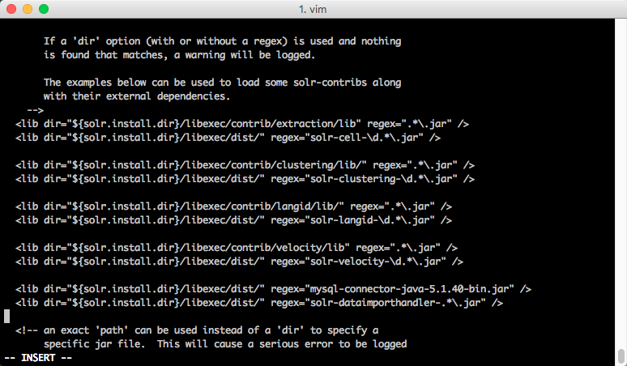

添加 MySQL 配置信息，在`<requestHandler name="/select" class="solr.SearchHandler">`的前面添加以下信息：
```
<requestHandler name="/dataimport" class="org.apache.solr.handler.dataimport.DataImportHandler">  
    <lst name="defaults">  
        <str name="config">data-config.xml</str>  
    </lst>  
</requestHandler>
```

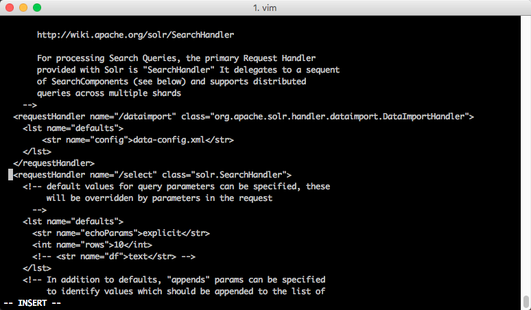

在同目录下新建`data-config.xml`文件：
```
vi /usr/local/Cellar/solr/6.1.0/server/solr/test/conf/data-config.xml
```
添加以下信息：
```
<?xml version="1.0" encoding="UTF-8"?>
<dataConfig>
    <dataSource name="source1"
                type="JdbcDataSource"
                driver="com.mysql.jdbc.Driver"
                url="jdbc:mysql://localhost:3306/solrdata"
                user="root"
                password="123456"
                batchSize="-1"/>
    <document>
        <entity name="goods"
                pk="id"
                dataSource="source1"
                query="select * from  goods"
                deltaImportQuery="select * from goods where id='${dih.delta.id}'"
                deltaQuery="select id from goods where updateTime> '${dataimporter.last_index_time}'">
            <field column="id"
                   name="id"/>　　
            <field column="name"
                   name="name"/>
            <field column="number"
                   name="number"/>
            <field column="updateTime"
                   name="updateTime"/>　
        </entity>
    </document>
</dataConfig>
```

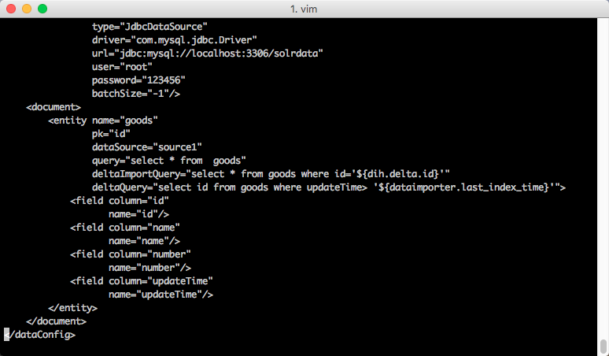

##  `managed-schema`配置`field`信息
```
vi /usr/local/Cellar/solr/6.1.0/server/solr/test/conf/managed-schema
```

新增以下信息：
```
<field name="name" type="string" indexed="true" stored="false" />
<field name="number" type="int" indexed="true" stored="false" />
<field name="updateTime" type="date" indexed="true" stored="false" />
```

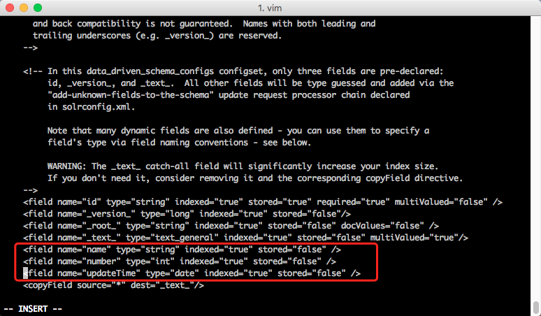

##  重启 Solr 服务
```
solr restart
```
返回以下信息说明 Solr 服务器重启成功：
```
Sending stop command to Solr running on port 8983 ... waiting 5 seconds to allow Jetty process 1446 to stop gracefully.
Waiting up to 30 seconds to see Solr running on port 8983 [/]
Started Solr server on port 8983 (pid=1784). Happy searching!
```

## Dataimport 操作
打开浏览器进入 Solr Admin，在以下界面中，点击`Execute`按钮：

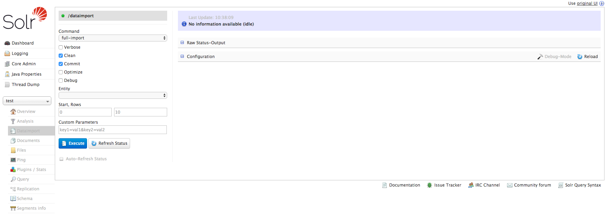

成功后，显示以下界面：

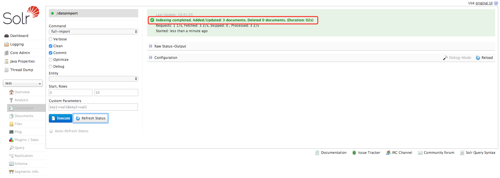

## Query 查询
进入 Query 页面，点击`Execute`按钮：

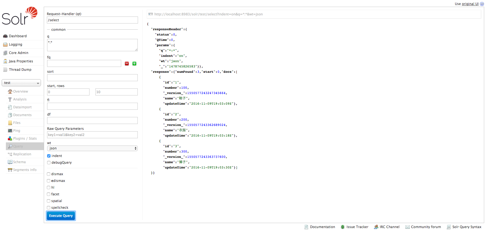


## 中文分词

下载必要的组件：
* IKAnalyzer jar 包: ik-analyzer-solr5-5.x.jar
* IKAnalyzer 配置文件: IKAnalyzer.cfg.xml
* 词库: mydict.dic 和 stopword.dic

下载地址：https://github.com/jxlwqq/Installing-Solr-and-indexing-MySQL-on-macOS/tree/master/file

下载后，将相关文件复制到相应的目录中，操作目录如下：

```
cp ik-analyzer-solr5-5.x.jar /usr/local/Cellar/solr/6.1.0/server/solr-webapp/webapp/WEB-INF/lib/
mkdir /usr/local/Cellar/solr/6.1.0/server/solr-webapp/webapp/WEB-INF/lib/classes/
cp IKAnalyzer.cfg.xml /usr/local/Cellar/solr/6.1.0/server/solr-webapp/webapp/WEB-INF/lib/classes/
cp mydict.dic /usr/local/Cellar/solr/6.1.0/server/solr-webapp/webapp/WEB-INF/lib/classes/
cp stopword.dic /usr/local/Cellar/solr/6.1.0/server/solr-webapp/webapp/WEB-INF/lib/classes/
```

修改 managed-schema 文件:
```
vi /usr/local/Cellar/solr/6.1.0/server/solr/test/conf/managed-schema
```
追加以下内容：
```
<fieldType name="text_ik" class="solr.TextField">
    <analyzer class="org.wltea.analyzer.lucene.IKAnalyzer"/>
</fieldType>
<field name="text_ik" type="text_ik" indexed="true" stored="true" multiValued="false"/>
```
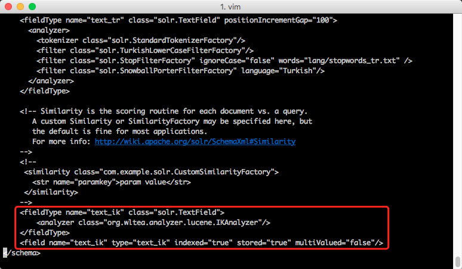
重启 Solr 或者重新加载test core：
```
solr restart
```
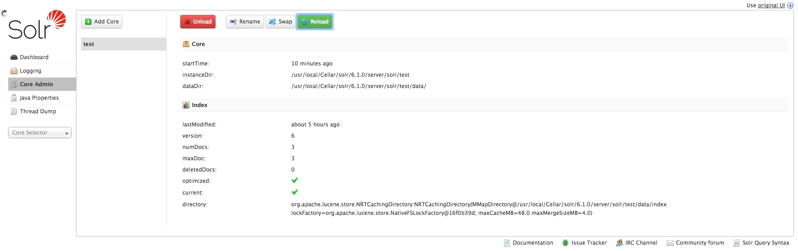

在 analysis 页面上进行测试：

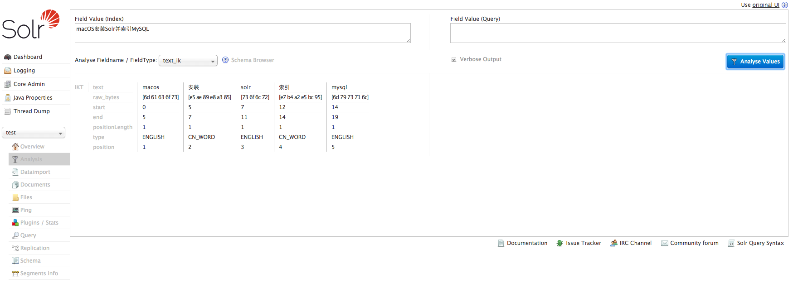


## 参考
* [solr教程，值得刚接触搜索开发人员一看](http://blog.csdn.net/awj3584/article/details/16963525#comments)
* [sorl6.0+jetty+mysql搭建solr服务](http://www.cnblogs.com/hujunzheng/p/5647896.html)
* [Solr之搭建Solr6.0服务并从Mysql上导入数据](http://blog.csdn.net/linzhiqiang0316/article/details/51464461)
* [solr6.0配置中文分词器IK Analyzer](http://blog.csdn.net/linzhiqiang0316/article/details/51554217)